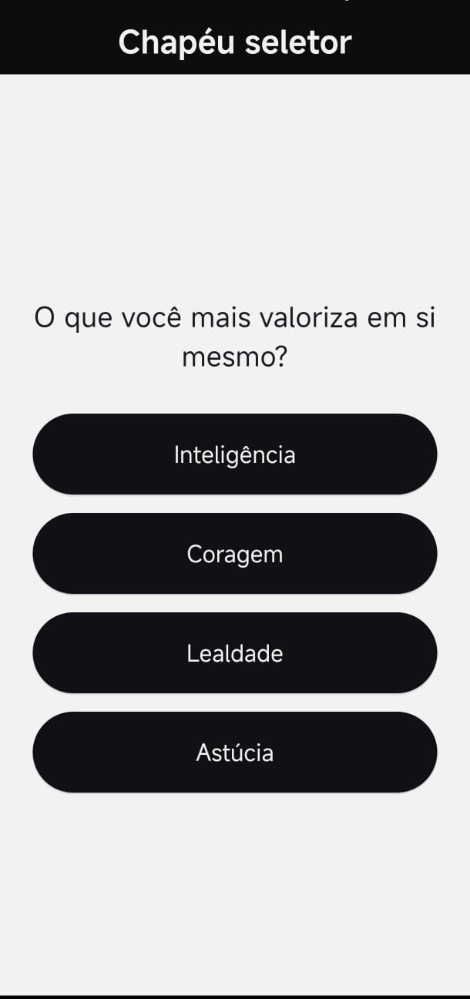

# Sorting Hat App

**sorting-hat-app** é um aplicativo inspirado no Chapéu Seletor de Harry Potter, desenvolvido com Flutter.  
Ele apresenta um quiz para determinar a casa de Hogwarts do usuário com base nas respostas escolhidas.




## 🧙‍♂️ Funcionalidades

- **Quiz Interativo**: apresenta perguntas com múltiplas opções de resposta.
- **Determinação de Casa**: aloca o usuário em uma das casas de Hogwarts com base nas respostas.

## 📱 Plataformas Suportadas

- Android  
- iOS  

## 🚀 Como Rodar o Projeto

### Pré-requisitos

- [Flutter](https://flutter.dev/docs/get-started/install) instalado.
- Editor de código como [VS Code](https://code.visualstudio.com/) ou [Android Studio](https://developer.android.com/studio).

### Passos

1. Clone o repositório:
   ```bash
   git clone https://github.com/RyanS1lva/sorting-hat-app.git

2. Navegue até o diretório do projeto:
   ```bash
   cd sorting-hat-app

3. Instale as dependências:
   ```bash
   flutter pub get 
   
4. Execute o aplicativo:
   ```bash
   flutter run

## 🛠️ Tecnologias Utilizadas

- Flutter

- Dart


